# Road Networks and Pollution

### The Code

This repo is for a project studying the impact of road network structure on air pollution. In order to recreate the data there are three steps. First, in the epa_aqs folder there are a series of files which, when run following the instructions in the epa_aqs readme file, will produce a pollution data set with observations at the county-day level. Second, go to [my NOAA weather data repo](https://github.com/cat-astrophic/NOAA) and follow the instrtuctions to create the raw weather data. Third, ensure the username + directory match the directory structure on your machine and run the following scripts:

1. vdot_road_closures_scraper.py *(this script scrapes raw data on road closures from VDOT ~ 90 GB)*
2. road_nets_IV.py *(this script creates the actual IVs)*
3. road_nets_va_poll_data.py *(this script creates Virginia pollution data)*
4. road_nets_noaa_data.py *(this creates Virginia weather data)*
5. road_nets_.py *(this script uses OSMnx to collect road network data from OSM, create network statistics, and create figures)*
6. road_nets_data_maker.py *(this script creates the final data set)*
7. road_networks_pollution_regs.R *(this script runs the other R scripts which, in turn, run the different econometric specifications)*

### The Data

Inside the compressed data folder, the following data files can be found:

* iv.csv *(the instruments data)*
* va_pollution_data.csv *(pollution data for Virginia)*
* va_weather_data.csv *(weather data for Virginia)*
* road_network_statistics.csv *(various road network statistics)*
* complete_data.csv *(the final data file for regression)*

### Installing OSMnx

This project uses OSMnx to access the OSM API and retrieve road network data. To install OSMnx:

1. Install Anaconda
2. Open the Anaconda prompt
3. Run the following code:
```
conda create --name geo
conda activate geo
conda install -c conda-forge fiona shapely rasterio pyproj pandas jupyterlab geopandas osmnx
jupyter lab
```

Following theses steps (1) creates a new environment called geo; (2) activates the new environment; (3) installs what is needed for OSMnx inside geo; (4) runs jupyter lab where you can begin to use OSMnx

### Summary Statistics Table

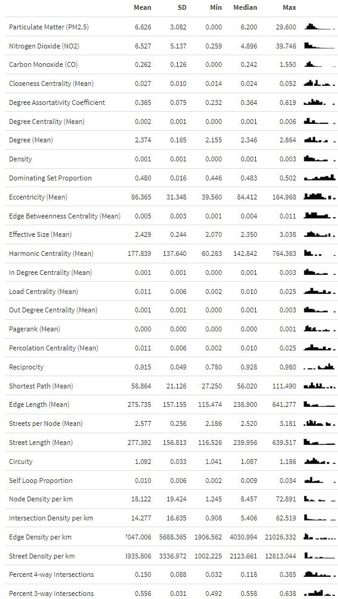

### Road Networks Weighted by Edge Betweennness Centrality

Fairfax County, VA

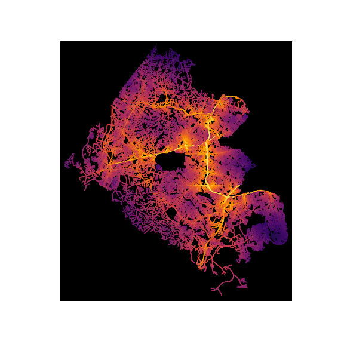

Henrico County, VA

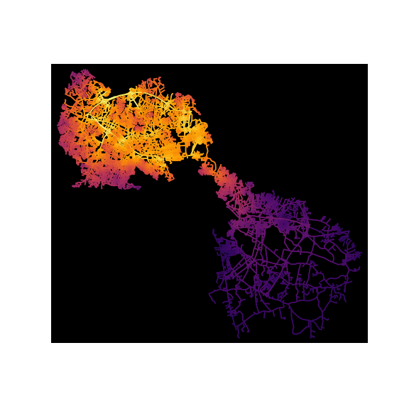

Hopewell, VA

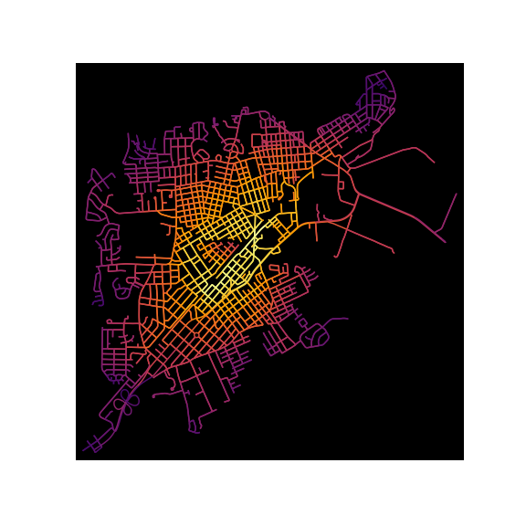

Richmond, VA

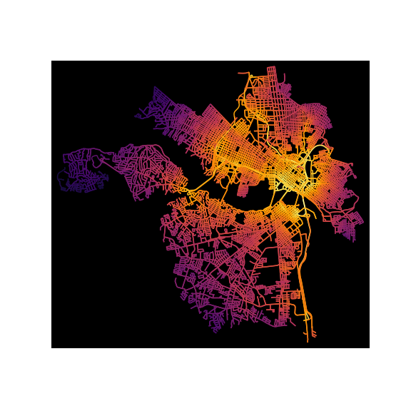

Arlington County, VA

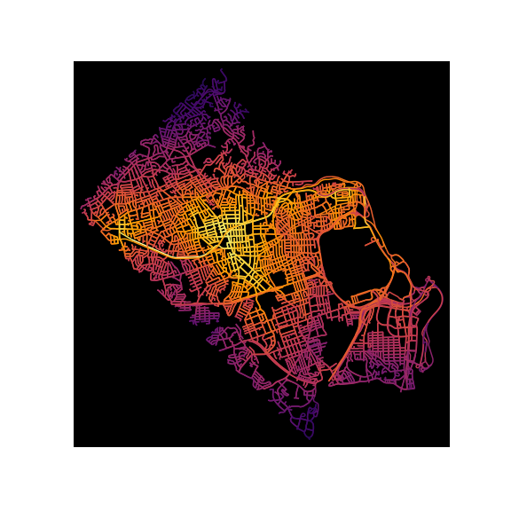

Alexandria, VA

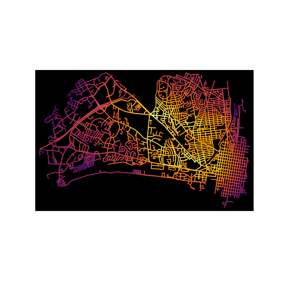

Salem, VA

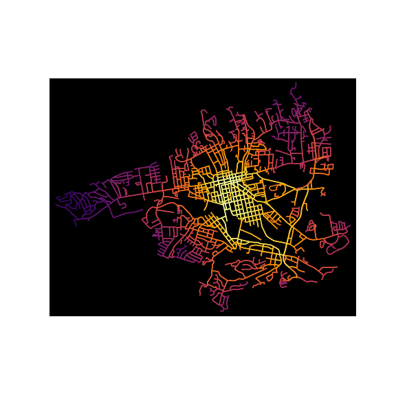

Norfolk, VA

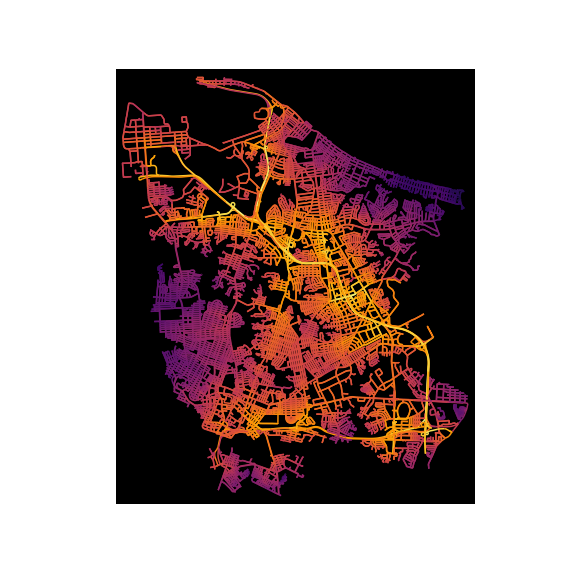

Roanoke, VA

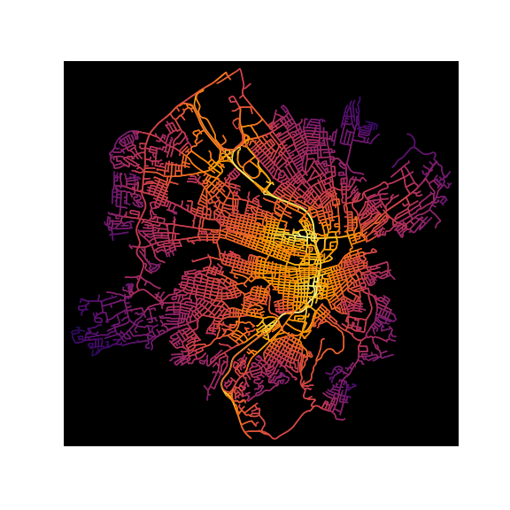

Virginia Beach, VA

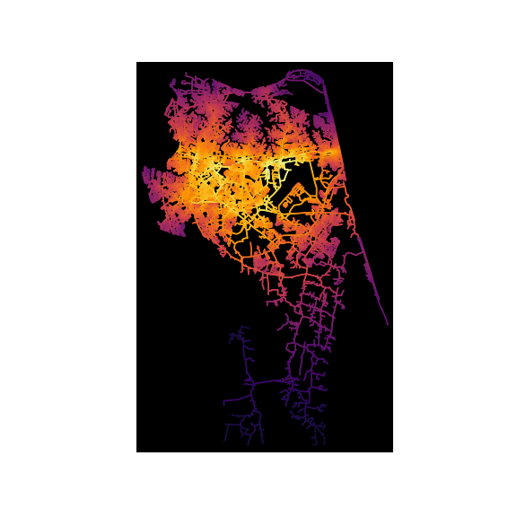
